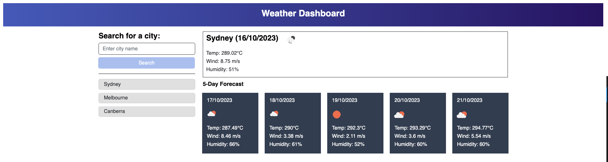

# WeatherDashboard

## Description

WeatherDashboard is a dynamic web-based application that provides users with current and future weather conditions for multiple cities. This tool is especially useful for travelers who want to plan their trips according to the weather outlook of their destinations.

- **Motivation**: As a traveler, understanding the weather conditions of a destination is crucial for planning. This application provides an easy and quick way to get weather details for multiple cities.
- **Purpose**: The WeatherDashboard serves as a comprehensive tool for users to check both current and future weather conditions of a city. It also maintains a search history for quick access to previously searched cities.
- **Problem it Solves**: It offers a one-stop solution for users to get detailed weather information, eliminating the need to browse multiple sites or apps.
- **What I Learned**: Building this dashboard enhanced my skills in API integration, handling asynchronous operations, and creating dynamic web interfaces.

## Installation

To get real-time weather details, visit the deployed website. For a local experience, clone the repository and open the `index.html` file in your favorite web browser.

## Usage

Experience the WeatherDashboard firsthand here: [WeatherDashboard](https://isaacmasterman.github.io/M06C-WeatherDashboard/)

Here's a snapshot of the WeatherDashboard in action:

## Credits

- The `reset.css` was sourced from the Week 2 Day 3 materials of the EdX Coding Bootcamp Course.

## License

This project is licensed under the MIT License.
